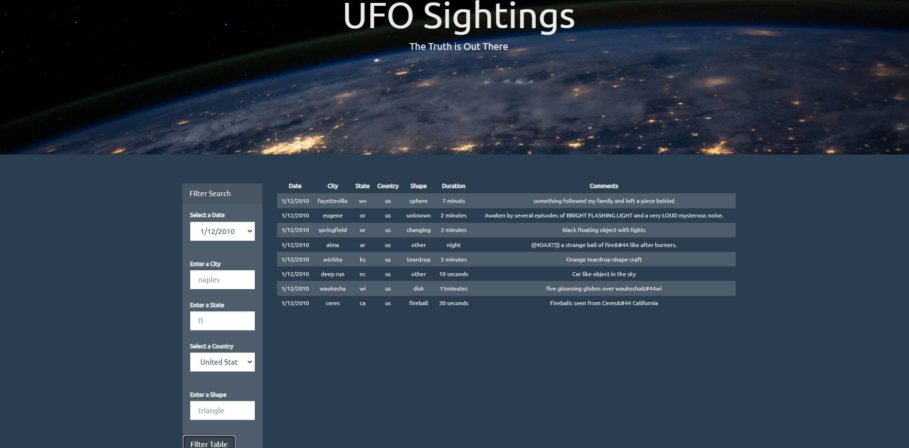

# JavaScript and DOM Manipulation

## Task

A code is written to create a table dynamically based upon a [provided dataset](UFO-level-1/static/js/data.js) to allow the users to filter the table data for specific values using JavaScript, HTML, and CSS, and D3.js coding languages.

### Level 1: Automatic Table and Date Search 

* A basic HTML web page is created.

* Using the UFO dataset provided in the form of an array of JavaScript objects, a code is written that appends a table to the web page and then adds new rows of data for each UFO sighting.

* The provided information is listed in a table including columns for `date`, `city`, `state`, `country`, `shape`, `duration` and `comment`.

* A date form is used in the HTML document and a JavaScript code is written that will listen for events and search through the `date` column to find rows that match user input.

### Level 2: Multiple Search Categories 

* In addition to level 1 criteria, multiple `input` tags and/or select dropdowns is used, and a JavaScript code is written so the user can set multiple filters and search for UFO sightings using the following criteria based on the table columns:

  1. `date`
  2. `city`
  3. `state`
  4. `country`
  5. `shape`

- - -

### Dataset

* [UFO Sightings Data](UFO-level-1/static/js/data.js)

- - -

### Result

